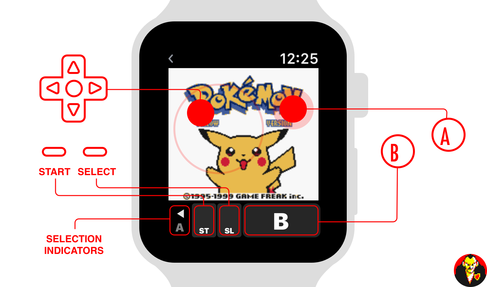

# GIOVANNI


**A Gameboy Emulator for the Apple Watch.**

**Interested in how this was made? Check out the write-up [here](http://gabrieloc.com/2017/03/21/GIOVANNI.html)**

## Installation

GIOVANNI uses a git submodule for its one dependency, which is a modified version of the [Gambatte](https://github.com/dimitridessus/gambatte) emulator. When cloning, ensure submodules are also pulled down:

``` bash
$ git clone --recursive git@github.com:dimitridessus/GIOVANNI.git
```
(or clone with a desktop app like Xcode or GitHub Desktop)

### NOTICE: You will receive an Xcode Project. Change any occurances of "dimitridessus" to that of your own name so that signing the app with your profile will work.

If you are still having issues, please follow the tutorial provided by [Redmond Pie](http://www.redmondpie.com/install-giovanni-game-boy-emulator-on-apple-watch-heres-how-tutorial/)

## Build

Depending on the version of Xcode used during the last commit, you should be able to clone the repository, change company info and press ⌘B to build the app or ⌘R to run it on whatever device or simulator you have for testing or running apps.

## Release

There won't be any releases submitted to this GitHub any time soon. I (dimitridessus, not gabrieloc) do not currently have the training or knowledge to create IPA or DEB packages for others to install themselves with apps such as Cydia Extender. You'll have to use Xcode to get it on your device for now. (I'm not entirely sure that signing-services sign the Apple Watch app's binaries anyway)
`(If anyone can help me with this, please do.)`

## Usage

Games are loaded from your iPhone's documents directory. In iTunes, drop `.gb`, `.gbc` or `.zip` files into the GIOVANNI app's documents folder, and they'll show up automatically on your Apple Watch. When you play a game for the first time, it'll download to your watch and get cached in the watch's documents directory. Subsequent loads are from the Watch itself, and are usually instant.

GIOVANNI can open ROMs natively, allowing you to bypass iTunes entirely. Find a `.gb`, `.gbc` or `.zip` containing a proper ROM and press "Open in" or the export button from Safari to find the "Copy to GIOVANNI" icon and import the ROM directly.

Emulator saving and loading is automatic, and happens whenever the app gets closed/inactivated or opened/activated. In-game saving and loading is completely separate. If for some reason the emulator save gets corrupted, force-touching the screen will bring up the option to reset the emulator, allowing you to resume from your in-game save.

The control scheme is as follows:



## Troubleshooting

Disclaimer: Due to the constraints of watchOS, you may experience crashes or graphical glitches. Keep in mind that this project likely does not align with what Apple expects from these devices, which in turn makes it difficult to optimize and debug this project.

If for some reason the app becomes unresponsive and must be force-quit, you can do so by having the app in the foreground, pressing the side (long) button, then pressing and holding the Digital Crown for about 5 seconds.

### Games don't show up
GIOVANNI relies on your iPhone for transferring games. Ensure your iPhone is paired, powered on and within reach.

### Garbled (or all white) pixels (uncommon)
Video memory can get corrupt. In such a case you will have to force emulation to be reset. While in-game, force-touch the screen and select Reset.
Sometimes the app will crash because this (and might not save).
If the app closes, you will have to re-open it and repeat this process until it works.

### Colors wrong
Some games appear to format pixel data differently. The rendering work is done in [GameCoreSnapshots.swift](https://github.com/dimitridessus/GIOVANNI/blob/master/gambatte_watchOS/GameCoreSnapshots.swift), you may have luck adjusting how the Core Graphics context is created.

## Known Issues

### Games sometime crash when trying to fill the sound buffer
The sound buffer isn't even used, but it *is* required by Gambatte. The issue goes away after re-opening the app, but is a huge pain regardless.
